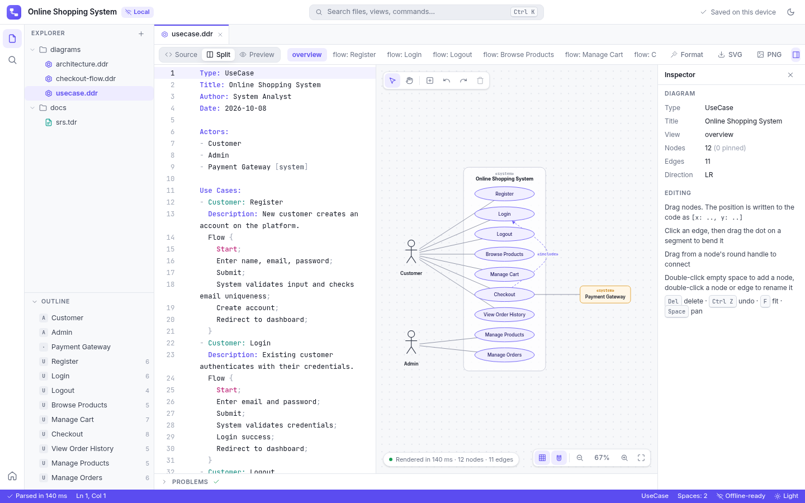
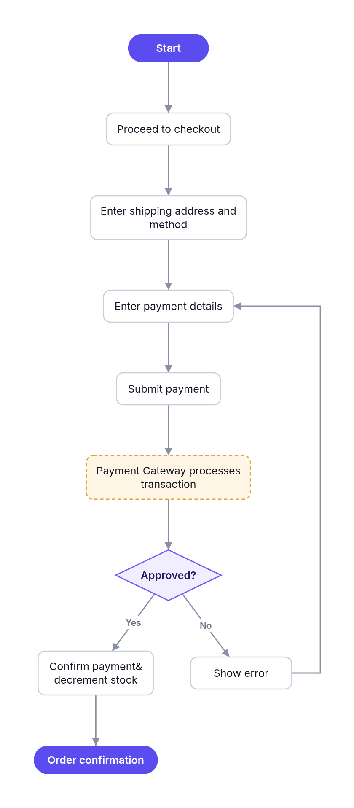
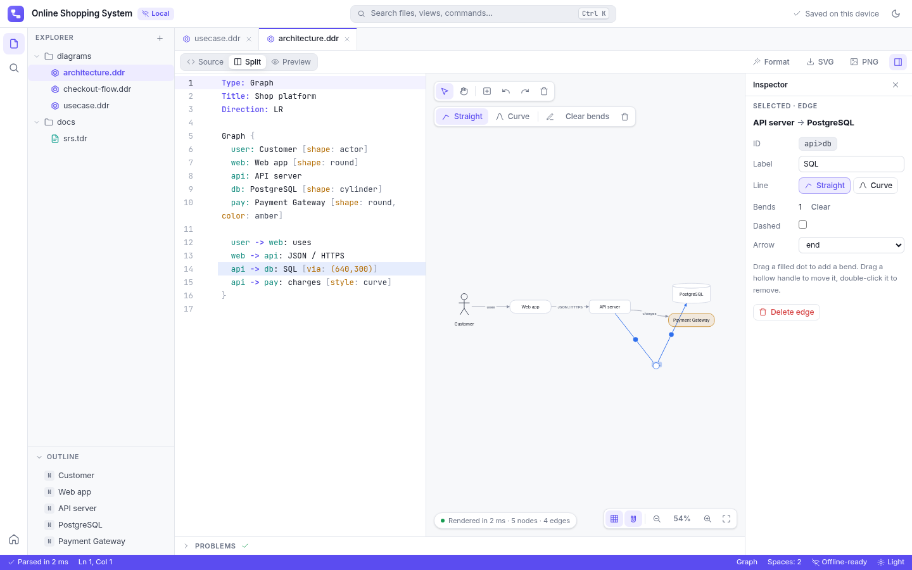
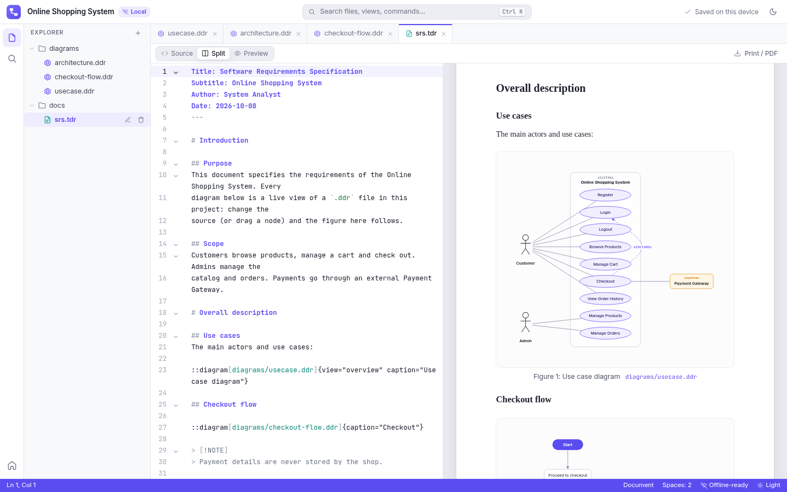

# DDR: Diagram Done Right  

The more you learn about software engineering, the less you'll write code, and the more you'll write documentation. This is what I call a "Diagram Done Right" (DDR), it eliminates the need to manually design and make diagram using markup code `.ddr` to keep you focused on keyboard and brainstorm along with LLM.  

## What it is

DDR is a document workspace for software engineers. You write diagrams and documents as plain text, and DDR draws them for you.

- **`.ddr` (Diagram Done Right)** for use case diagrams, flowcharts and graphs. Source on the left, live diagram on the right, like Overleaf.
- **`.tdr` (Text Done Right)** for SRS, papers and reports. It's Markdown that can embed any `.ddr` view, so your document always shows the latest diagram.
- **Both ways editable.** Drag a node, bend an edge (straight or curved) or rename a label in the diagram, and DDR writes only that change back into your code. Edit the code, and the diagram follows.
- **Offline first.** This repo is the standalone PWA: everything runs in your browser and your files stay on your device. Install it from the address bar and it works without internet.

Try it here: **https://fastering.thedev.id/ddr-free/**



## Examples

### `.ddr` code to diagram

```
Type: Flowchart
Title: Checkout
Author: System Analyst
Date: 2026-10-08

# Positions are optional. Drag a node in the preview and DDR writes
# [x, y] back here. Nodes without positions get auto layout.
Flow {
  start: Start
  Proceed to checkout
  Enter shipping address and method
  pay: Enter payment details
  Submit payment
  @Payment Gateway processes transaction
  if Approved? {
    confirm: "Confirm payment&
    decrement stock"
    End Order confirmation
  } else {
    Show error
    goto pay
  }
}
```

Result:



A few things in there:
- `pay:` gives a node an id, so `goto pay` can point back to it.
- A quoted label can span lines. The leading spaces on the next line are ignored up to the column where the statement starts.
- Add `[x: 300, y: 120]` after a label to pin it, or just drag it and DDR adds it for you.

Click an edge to get midpoint handles, drag them to bend the line, and switch between straight and curved:



### `.tdr` code to document

```
Title: Software Requirements Specification
Subtitle: Online Shopping System
Author: System Analyst
Date: 2026-10-08
---

# Overall description

## Use cases
The main actors and use cases:

::diagram[diagrams/usecase.ddr]{view="overview" caption="Use case diagram"}

## Checkout flow

::diagram[diagrams/checkout-flow.ddr]{caption="Checkout"}

| ID    | Requirement                                    | Priority |
|-------|------------------------------------------------|----------|
| FR-01 | The customer can register with email.          | Must     |
| FR-02 | The customer can pay with the payment gateway. | Must     |
```

Result:



## Status

**v0.0.3, early preview (prerelease).** Expect rough edges and syntax changes before 1.0.

Working now:
- `.ddr` use case diagrams, flowcharts and graphs, with live preview and error hints in the editor
- Drag nodes, bend edges, straight or curved lines, edge labels, undo and redo, all written back to the code
- `.tdr` documents with embedded diagrams and print to PDF
- Explorer, tabs, command palette, light and dark theme
- Works offline once installed

Not yet:
- Sequence, ERD and class diagrams
- Rich text editing for `.tdr`
- Export to DOCX

A fullstack version with accounts, sharing and real-time collaboration is being built separately.

## License

No license has been chosen yet. Until one is added, please ask before reusing the code.
